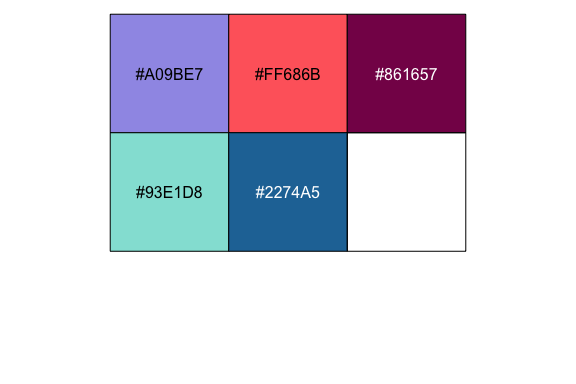

# ggrunoff

Builds plot styling and colour palette for the website The Runoff.

## Installation

You can install `ggrunoff` from GitHub by running the following:

``` r
devtools::install_github("hendersontrent/ggrunoff")
```

## The palette

The colour palette for The Runoff uses 5 colours:

``` r
library(scales)

scales::show_col(ggrunoff:::runoff_palette)
```

<!-- -->
